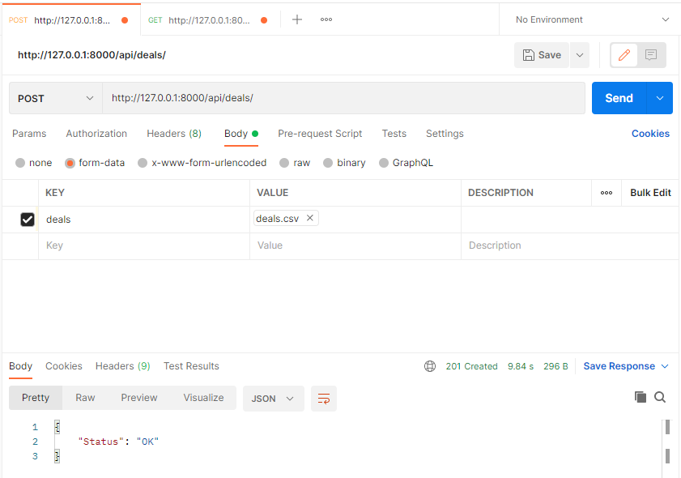
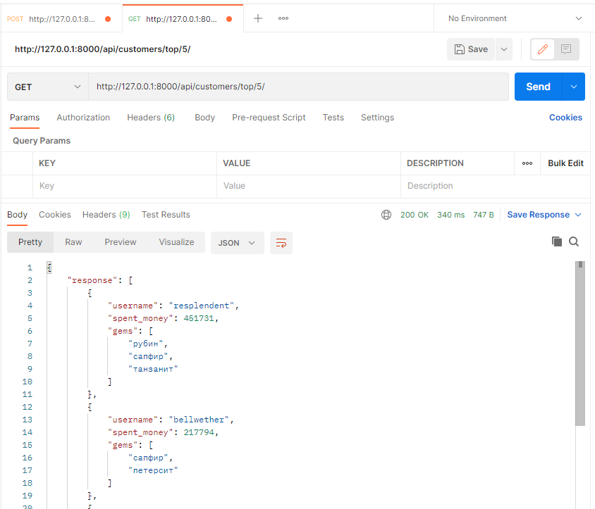

## Процесс установки и запуска
1. клонировать данный репозиторий в нужную локальную директорию командой ```git clone https://github.com/KristinaErdman/Deals.git```
2. перейти в директорию Deals, содержающую файлы: Dockerfile и docker-compose.yml
3. запустить проект командой ```[sudo] docker-compose up```

! По причине технических неполадок контейнеризировать приложение пришлось с помощью __виртуальной__ машины. _Возможно_ с этим связано то, что по команде ```docker-compose up``` контейнер запускается, но приложение по указанному адресу не отвечает.

## Процесс работы с сервисом
### 1. Загрузка файла для обработки
Для загрузки файла, содержащего историю сделок необходимо отправить запрос с методом POST по адресу: __http://127.0.0.1:8000/api/deals/__

Аргументы:
* deals: файл, содержащий историю сделок.

Файл, содержащий историю сделок должен иметь формат __csv__ и содержать следующие поля:
* customer - логин покупателя
* item - наименование товара
* total - сумма сделки
* quantity - количество товара, шт
* date - дата и время регистрации сделки

Ответ:
* Status: OK - файл был обработан без ошибок;
* Status: Error, Desc: <Описание ошибки> - в процессе обработки файла произошла ошибка.


### 2. Выдача обработанных данных
Для получения списка клиентов, потративших наибольшую сумму за весь период необходимо отправить запрос с методом GET по адресу: __http://127.0.0.1:8000/api/customers/top/limit/__
где 
* limit - количество клиентов, потративших наибольшую сумму за весь период 

В ответе содержится поле “response” со списком из limit клиентов, потративших наибольшую сумму за весь период.

Каждый клиент описывается следующими полями:
* username - логин клиента;
* spent_money - сумма потраченных средств за весь период;
* gems - список из названий камней, которые купили как минимум двое из списка "limit клиентов, потративших наибольшую сумму за весь период", и данный клиент является одним из этих покупателей.


